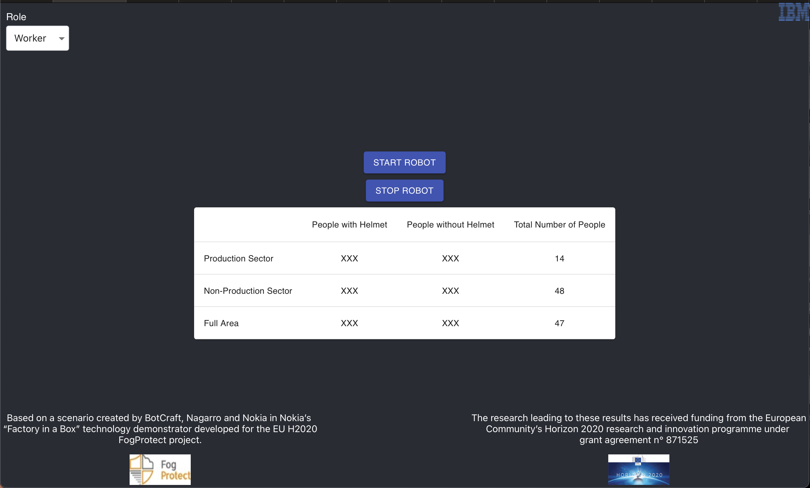

# FogProtect Usecase
This is an application that demonstrates the use of [fybrik](https://github.com/fybrik/fybrik) and 
leverages it to control the data flow between a webserver and a data server, where the webserver 
sends HTTP requests to a REST-base data server and the data server responds accordingly.  

This application demonstrates how runtime policy evaluation can be handled by Fybrik by having the 
Fybrik module communication with a local version of OPA (loaded as a sidecar).  User authentication guaranteed
by a JWT (JASON Web Token) which accompanies each REST request for data.  This allows for the user (role) to be 
dynamically changed between data access results.

## Architecture
The project contains 3 main components:  
- A backend data service, which provides the mock data for the dashboard.  
- A fybrik module, responsible for intercepting HTTP requests sent from a user trying to read or write data.  
- A dashboard application, which performs HTTP requests and displays the responses for the user.

### High Level Flow Description
Once the whole environment is built (following the instructions below), a user can visit address
`http://127.0.0.1:3001` in his desired browser, in order to use the GUI shown in the picture bellow:  
  

The above dashboard demonstrates some of the capabilities of fybrik, and the source code of this project provides 
a usage example of fybrik resources.  

Looking at the dashboard, there are following elements:  
- A "Role" roll down menu, where the user can choose either one of the roles: `Worker`, `Foreman` and `HR`. This 
choice determines the read/write privileges of the user from the backend server, and from this point forward all 
of the HTTP requests sent from the GUI to the proxy will contain this role in the header, so that 
the proxy server can retrieve it and decide what to do next.  
**passing the role to the proxy server:** The role is passed in a JWT and authenticated using a secret key, the 
proxy server decodes the JWT and validates the authentication using the same secret key. In this case 
the private key is stored in a `secret` in the cluster.  
- A "START ROBOT" and "STOP ROBOT" buttons which control the robot working in the factory, only a foreman is allowed
to control the robot, other roles have no such privilege and their request will be blocked by the fybrik module.  
- A safety table, which contains the data defined in the asset `assets/asset_get_safety_data.yaml`. This data
contains the number of employees in each area in the factory, and the number of employees wearing/not wearing helmets.  

#### ِAn Example of a Request
Assume a user with a worker role who would like to look at the safety data of the factory. The user sends an HTTP 
request to the URL: `http://127.0.0.1:5559/api/personnel_data/get_safety_data` (after creating the port-forwarding 
as discussed in the [Deployment](#Deployment) section below), while specifying his role in the header of the request. 
The role can be either passed explicitly, or encoded as a JWT (if it is encoded using JWT, then it should be authenticated 
using the secret key specified in `secrets/jwt_key_secret.yaml` in order for the module to verify it using the same key).  
Once the service intercepting the HTTP requests (defined by the module) receives this request, it would need to make 
a decision on what action to do next. For this purpose, the intercepting process sends the name of the asset requested, 
along with the role of the user to the [OPA](https://www.openpolicyagent.org) sidecar, which has the policies that 
should be applied. Based on the policies OPA returns a response to the intercepting process that contains a list 
of actions that should be applied in this case, these actions might be one the following:  
- ALLOW - meaning that the intercepting process should get the data from the backend data service, without having 
to change anything in the data, and sending it back to the user as is.  
- REDACT - meaning that the intercepting process should get the data from the backend data service, however before 
returning a response to the user, the data should be modified, and following the defined policies, the process would 
have a list of columns (rows not yet supported) in the data (`csv` format) that should be redacted for this specific 
role of the user (this list would be received from OPA along with the action that should be made). Once the process 
goes over the data and modifies it accordingly, it sends a response back to the user containing the modified data.  
- BLOCK - meaning that the intercepting process will not forward the request to the backend data service, and it 
will respond to the user with a status of "access forbidden".  

Following the example, in our case the intercepting process will receive a REDACT action from OPA with a list of 
columns that should be redacted. Next, the process will send an HTTP request to the backend data service requesting 
the needed data. Once the data is received, the process redacts the columns and returns a response to the user.  

  
## Environment Build
1) Follow the steps of the QuickStart Guide in: https://fybrik.io/v0.6/get-started/quickstart/.  

Displayed here for convenience:  
   1) ```shell
      kind create cluster --name kind-cluster
   2) ```shell
      helm repo add jetstack https://charts.jetstack.io 
      helm repo add hashicorp https://helm.releases.hashicorp.com 
      helm repo add fybrik-charts https://fybrik.github.io/charts 
      helm repo update
   3) ```shell
      helm install cert-manager jetstack/cert-manager \
      --namespace cert-manager \
      --version v1.2.0 \
      --create-namespace \
      --set installCRDs=true \
      --wait --timeout 120s
   4) ```shell
      helm dependency update charts/vault
      helm install vault charts/vault --create-namespace -n fybrik-system \
      --set "vault.injector.enabled=false" \
      --set "vault.server.dev.enabled=true" \
      --values charts/vault/env/dev/vault-single-cluster-values.yaml
      kubectl wait --for=condition=ready --all pod -n fybrik-system --timeout=120s
   5) ```shell
      helm install fybrik-crd fybrik-charts/fybrik-crd -n fybrik-system --wait
      helm install fybrik fybrik-charts/fybrik  -n fybrik-system --wait
   6) Change the current directory to the previous directory:
   ```shell
   cd ..
   ```
2) Create a namespace that will contain the application and the backend data server:  
    ```shell
    kubectl create namespace fogprotect
    kubectl config set-context --current --namespace=fogprotect
    ```
3) Clone the repo
   git clone https://github.com/fybrik/fogProtect-dashboard-sample.git 

## Deployment
1) Deploy the backend data server:
    ```shell
    export HELM_EXPERIMENTAL_OCI=1
    helm install rel1-backend-server  oci://ghcr.io/fybrik/backend-server-chart --version=v0.0.1
    ```

2) Create the assets:
    ```shell
    kubectl apply -f https://raw.githubusercontent.com/fybrik/fogProtect-dashboard-sample/main/assets/asset_get_safety_data.yaml
    kubectl apply -f https://raw.githubusercontent.com/fybrik/fogProtect-dashboard-sample/main/assets/asset_start_robot.yaml
    kubectl apply -f https://raw.githubusercontent.com/fybrik/fogProtect-dashboard-sample/main/assets/asset_stop_robot.yaml
    ```  

3) Set up the jwt authentication secret with an associated service account and ClusterRole definition for secret readers
    ```shell
    kubectl apply -f https://raw.githubusercontent.com/fybrik/fogProtect-dashboard-sample/main/fybrik-jwt-secret-reader.yaml
    ```
4) Apply the global policy
5) ```shell
   kubectl -n fybrik-system create configmap dashboard-policy --from-file=https://raw.githubusercontent.com/fybrik/fogProtect-dashboard-sample/main/dashboard-policy.rego
   kubectl -n fybrik-system label configmap dashboard-policy openpolicyagent.org/policy=rego
   ```

5) Deploy the fybrik module and application:
    ```shell
    kubectl apply -n fybrik-system -f https://raw.githubusercontent.com/fybrik/fogProtect-dashboard-sample/main/rest-read-module.yaml
    kubectl apply -f https://raw.githubusercontent.com/fybrik/fogProtect-dashboard-sample/main/rest-read-application.yaml
    kubectl wait --for=condition=ready --all pod --timeout=120s
    ```

6) Create a port-forwarding to the filter service:  
    ```shell
    kubectl -n fybrik-blueprints port-forward svc/rest-read 5559:5559 &
    ```

7) Deploy the pod of the GUI:
    ```shell
    helm chart pull ghcr.io/fybrik/factory-gui-chart:v0.0.1
    helm chart export --destination=./tmp ghcr.io/fybrik/factory-gui-chart:v0.0.1
    helm install rel1-factory-gui ./tmp/factory_gui
    kubectl wait --for=condition=ready --all pod --timeout=120s
    ```

8) Create a port-forwarding to the GUI service:
    ```shell
    kubectl port-forward svc/factory-gui 3001:3000 &
    ```  

9) Open a browser and go to: `http://127.0.0.1:3001` to use the GUI.  

### Cleanup
1. Stop the port-forwarding:
    ```shell
    pgrep -f "kubectl port-forward svc/factory-gui 3001:3000" | xargs kill
    pgrep -f "kubectl -n fybrik-blueprints port-forward svc/rest-read 5559:5559" | xargs kill
    ```
2. Remove the `tmp` directory:
    ```shell
    rm -r tmp
    ```
3. Delete the `fogprotect` namespace:  
    ```shell
    kubectl delete namespace fogprotect
    ```
4. Delete the module:  
    ```shell
    kubectl -n fybrik-system delete fybrikmodule rest-read-module
    ```
5. Delete the JWT secrets and service account:  
    ```shell
    kubectl delete -f https://raw.githubusercontent.com/fybrik/fogProtect-dashboard-sample/main/fybrik-jwt-secret-reader.yaml
    ```

## Development
1) Clone this repository:  
    ```shell
    git clone git@github.com:fybrik/fog-protect.git
    ```

2) Follow the instructions in https://github.com/fybrik/hello-world-read-module#installation 
under the `Installation` section, brought here for convenience:  
   -  After modifying the values in the Makefile as required in the link above, 
      **make sure that the current directory is `fog-protect/`**. Invoke:  
      ```shell
      export HELM_EXPERIMENTAL_OCI=1
      make docker-build
      make docker-push
      make helm-login
      make helm-verify
      make helm-chart-push
      ```
    **Improtant: make sure that the repositories where the docker image and the helm chart were pushed 
       are public**  
3) Apply the ClusterRole and jwt secret:  
    ```shell
    kubectl apply -f fybrik-jwt-secret-reader.yaml -n fybrik-system
    ```
4) Apply all of the assets in the `forprotect` namespace (the current context of `kubectl`):  
    ```shell
    kubectl apply -f assets/
    ```

5)    **The secret in 'fybrik-jwt-secret-reader.yaml` contains the secret key used as the authentication key for the 
    JWT used by both the REST module and the frontend GUI. In order to change the key, you can invoke:  
   - ```shell
     echo -n '<your_key>' | base64
     ```
     Once you get the base64 encoding of your key, modify the value of `data.jwt_key` in `fybrik-jwt-secret-reader.yaml`. 
     In order for the change to take effect, the GUI and the rest-read pods need to be restarted.  

6) Apply the module in the `fybrik-system` namespace:  
    ```shell 
    kubectl apply -f rest-read-module.yaml -n fybrik-system
    ```
7) Apply the application in the `fogprotect` namespace (current `kubectl` context):
    ```shell
    kubectl apply -f rest-read-application.yaml
    kubectl wait --for=condition=ready --all pod --timeout=120s
    ```
8) Create the port-forwarding to the `rest-read` service:  
    ```shell
    kubectl -n fybrik-blueprints port-forward svc/rest-read 5559:5559
    ```
9) To build the image for the GUI and push it to the public images registry specified in the makefile, invoke the 
following:
    ```shell
    make DOCKER_IMG_NAME=factory-gui DOCKER_FILE=./gui/Dockerfile DOCKER_IMG_CONTEXT=./gui docker-all
    make DOCKER_CHART_IMG_NAME=factory-gui-chart DOCKER_IMG_NAME=factory-gui DOCKER_FILE=./gui/Dockerfile CHART_PATH=./gui/helm helm-verify
    make DOCKER_CHART_IMG_NAME=factory-gui-chart DOCKER_IMG_NAME=factory-gui DOCKER_FILE=./gui/Dockerfile CHART_PATH=./gui/helm helm-chart-push
    ```
   - To deploy the GUI pod invoke:
       ```shell
       make DOCKER_CHART_IMG_NAME=factory-gui-chart DOCKER_IMG_NAME=factory-gui DOCKER_FILE=./gui/Dockerfile CHART_PATH=./gui/helm helm-install
       kubectl wait --for=condition=ready --all pod --timeout=120s
       ```
     Create a port-forwarding to the GUI service:
       ```shell
       kubectl port-forward svc/factory-gui 3001:3000
       ```
10) To build the image for the backend server and push it to the public image registry specified in the makefile, invoke the 
following:
    ```shell
    make DOCKER_IMG_NAME=backend-server DOCKER_FILE=./python/backend/Dockerfile DOCKER_IMG_CONTEXT=./python/backend docker-all
    make DOCKER_CHART_IMG_NAME=backend-server-chart DOCKER_IMG_NAME=backend-server DOCKER_FILE=./python/backend/Dockerfile CHART_PATH=./python/backend/helm helm-verify
    make DOCKER_CHART_IMG_NAME=backend-server-chart DOCKER_IMG_NAME=backend-server DOCKER_FILE=./python/backend/Dockerfile CHART_PATH=./python/backend/helm helm-chart-push
    ```
    - To deploy the backend server pod invoke:
      ```shell
      make DOCKER_CHART_IMG_NAME=backend-server-chart DOCKER_IMG_NAME=backend-server DOCKER_FILE=./python/backend/Dockerfile CHART_PATH=./python/backend/helm helm-install
      ```  

Another option instead of pushing the images to a public image registry is to build them locally and load them into the local
cluster. To do that, first change the value of the variable `image.name` to `<image_name>:<tag>` in the relevant 
`values.yaml` file related to the helm chart being deployed, and then invoke the following:
```shell
docker build -t <image_name>:<tag> .
kind load docker-image <image_name>:<tag> --name kind-cluster
helm package <your_helm_directory>
helm install <your_chart_name> <your_package_name.tgz>
```  
For example, to build the backend server locally, change the value of the variable `image.name` to `backend_server:v1` in the file
`python/backend/helm/values.yaml` and then invoke the following:
```shell
cd python/backend
docker build -t backend_server:v1 .
kind load docker-image backend_server:v1 --name kind-cluster
helm package helm/
helm install backend-service backend_server-0.1.0.tgz
``` 

11) Open a browser and go to: `http://127.0.0.1:3001` to use the GUI.  
